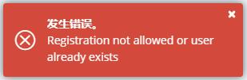
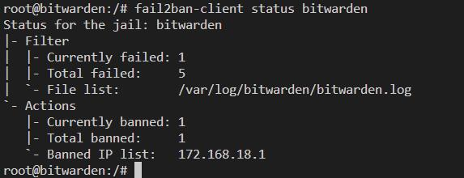

# bitwarden-docker

> docker 一键部署密码管理工具

------

## 0x00 简介

[bitwarden](https://bitwarden.com/) 是一款类似于 1password 的、可运行在 PC 和移动端、支持多系统跨平台的密码管理工具。

但 1password 是付费的、而且密码托管在第三方平台，部分同学担心自己的重要密码被泄露，此时就可以使用 bitwarden 搭建自己的私人密码管理服务。


## 0x10 环境要求

生产环境: 

测试环境:  

> 这里是 bitwarden 服务端的运行环境要求，客户端直接从 Google Store 或者 Apple Store 下载即可


## 0x20 事前准备（本地测试可跳过）

### 0x21 租用云服务器

由于 bitwarden 服务端是暴露在公网环境的，因此需要租用一台具备公网 IP 的云主机。

配置不用太高，个人使用的话 1C2G 完全够用。

> 阿里云、腾讯云、亚马逊 等等很多云服务商，等打折时随便挑就可以了。


### 0x22 购买域名

因为后面需要申请 HTTPS ，所以这里需要再租用一个域名，这里推荐到 [namesilo](https://www.namesilo.com/) 租用域名，新域名非常便宜，租一个冷僻的域名就可以了，到期之后不要续期，直接换域名可以享受最低价。

购买域名后，在 namesilo 将其解析到前面云主机的公网 IP 即可。

> 不推荐在国内服务商租用域名，需要备案，非常麻烦


### 0x23 安装 certbot

由于 bitwarden 服务端是暴露在公网环境的，因此对安全性要求较高（毕竟谁也不想自己的账密被 Hacker 盗走了）。

所以为你的域名申请 HTTPS 证书就很有必要了，最常用的就是通过 [Let's Encrypt](https://letsencrypt.org/) 申请免费 HTTPS 证书。

而为了使用 [Let's Encrypt](https://letsencrypt.org/) ，需要在云主机上安装 certbot，安装方法略。

> 之所以不把 certbot 也做成 docker 容器，是因为它需要交互式注册等一系列配置，入侵性太强，做成容器反而不方便。


### 0x24 为域名申请免费 HTTPS 证书

假如你购买的域名为 `demo_domain.com`，那么用 certbot 执行以下命令即可：

```shell
/usr/bin/certbot certonly --standalone -d demo_domain.com -d www.demo_domain.com
```

注：

- 若找不到 certbot 脚本路径，请自行检查其安装位置是不是 `/usr/bin/`
- 该命令需要先把 DNS 解析到当前服务器才能成功生成证书
- 若是第一次执行该命令，需要根据交互步骤先注册邮箱，以后不再需要。
- 若是更换过域名，需要先删除 `/etc/letsencrypt/live/旧域名` 和 `/etc/letsencrypt/renewal/旧域名.conf`，否则无法生成新域名的证书。
- 生成证书时会使用 80 端口，若有服务占用了 80 端口，需要先关停服务，待证书创建完之后再重启 80 服务。


## 0x30 部署步骤

1. 云主机安装 python3、docker、docker-compose
2. 拉取此工程: `git clone https://github.com/lyy289065406/bitwarden-docker /usr/local/bitwarden-docker`
3. 切换目录: `cd /usr/local/bitwarden-docker`
4. 构建镜像: `bin/build.[sh|ps1]`
5. 复制 HTTPS 证书到工程内（测试环境跳过）: `bin/renew_cert.sh "/usr/local/bitwarden-docker"`
6. 第一次运行 bitwarden 服务（开放注册）: 
    - 测试环境: `bin/run.[sh|ps1] -p "http" -d "127.0.0.1" -r "true"`
    - 生产环境: `bin/run.[sh|ps1] -p "https" -d "demo_domain.com" -r "true"`
7. 访问 bitwarden 为自己注册一个主账号:
    - 测试环境: http://127.0.0.1:35127/nedrawtib
    - 生产环境: https://demo_domain.com:35128/nedrawtib
8. 停止 bitwarden 服务: `bin/stop.[sh|ps1]`
9. 重新运行 bitwarden 服务（关闭注册）: 
    - 测试环境: `bin/run.[sh|ps1] -p "http" -d "127.0.0.1"`
    - 生产环境: `bin/run.[sh|ps1] -p "https" -d "demo_domain.com"`



> 端口号 和 路由地址 之所以设计为不容易记忆，主要时为了防止公网扫描


## 0x40 服务暴露

为了安全起见，目前 [docker-compose.yml](./docker-compose.yml) 中服务暴露设置如下:

| 环境 | 暴露端口 | 暴露范围 | 协议 | 备注 |
|:---:|:---:|:---:|:---:|:---|
| 测试环境 | 35127 | 127.0.0.1 | http | 由于限制了本地访问，连局域网的 bitwarden 客户端都无法访问。<br/>如需要测试客户端，可以修改 [docker-compose.yml](./docker-compose.yml)，把 127.0.0.1 去掉即可 |
| 生产环境 | 35128 | 0.0.0.0 | https | - |


## 0x50 使用

至此 bitwarden 服务已成功运行，下载客户端即可:

- PC 平台: 在官网 https://bitwarden.com/download/ 下载
- 移动端: 在 Google Store 或者 Apple Store 搜索 bitwarden 下载

安装后，需要在应用内设置服务器的 URL 为私服地址（否则默认是连接到官方服务器的）:

- 测试环境: http://127.0.0.1:35127/nedrawtib
- 生产环境: https://demo_domain.com:35128/nedrawtib

> 使用时务必记得主账号密码，否则一旦忘记、可能所有密码都找不回来了


## 0x60 可选: 防爆破

由于 bitwarden 服务端是暴露在公网环境的，因此建议生产环境的云主机开启防爆破：

1. 安装 fail2ban
2. 修改 jail 配置，把 `logpath` 指向此工程下的 `logs/bitwarden/bitwarden.log` 日志（绝对路径）
3. 复制 jail 配置: `cp ./fail2ban/jail/bitwarden.local /etc/fail2ban/jail.d/bitwarden.local`
4. 复制 filter 配置: `cp ./fail2ban/filter/bitwarden.local /etc/fail2ban/filter.d/bitwarden.local`
5. 启动防火墙: `service iptables start`
6. 启动 fail2ban: `service fail2ban start`

开启防爆破之后，可以模拟输错 3 次密码，然后执行以下命令可以查看封禁记录:

`fail2ban-client status bitwarden`



> 之所以不集成到 docker 内，是因为在 docker 内无法检测到用户 IP，会误封网关 IP


## 0x70 可选: 自动刷新证书

certbot 申请的证书有效期为 90 天，在到期前的 30 天可以重新执行此命令更新证书有效期: `/usr/bin/certbot renew`

但是每次都手动更新会比较麻烦，可以把 [renew_cert.sh](renew_cert.sh) 脚本设置到 crontab 自动更新证书：

```shell

# 编辑定时任务
crontab -e

# 每两个月更新一次证书
0 0 1 */2 0 /bin/sh /usr/local/bitwarden-docker/renew_cert.sh "/usr/local/bitwarden-docker"
```


## 0x80 可选: Mysql 方案

默认情况下，bitwarden 是使用加密的 sqlite3 作为数据库存储账密的，个人或家庭使用时完全没问题的，单机模式也推荐使用此方案。

但是如果是企业等环境需要共享给团队使用，推荐把数据库移植到 Mysql 等数据库，以便确保数据和服务分离，便于管理。

具体只需要修改 [docker-compose.yml](./docker-compose.yml) 的 `DATABASE_URL` 指向即可，详见[官方文档](https://github.com/dani-garcia/vaultwarden/wiki/Using-the-MariaDB-(MySQL)-Backend)说明（提供了建库脚本和迁移命令）。


## 0xFF 参考文档

- 《[Vaultwarden Wiki](https://github.com/dani-garcia/vaultwarden/wiki)》
- 《[Bitwarden 部署和使用](https://host.ppgg.in/deploying-and-using-of-vaultwarden/configuration)》
- 《[自己部署 Bitwarden 服务](https://mrchi.cc/posts/selfhosted-bitwarden/)》
- 《[搭建 bitwarden_Docker 轻松部署 Bitwarden 私有密码管理系统服务](https://blog.csdn.net/weixin_35723924/article/details/112568338?share_token=b97f55ae-bc1b-4b5b-9742-97fa9bc3472d)》
- 《[如何使用 fail2ban 来防范 SSH 暴力破解](https://learnku.com/server/t/36233)》

